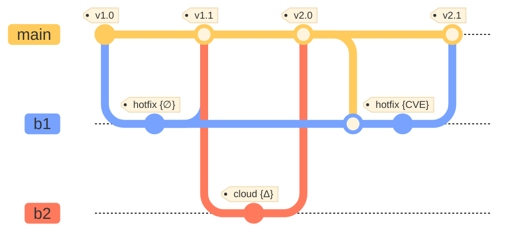

# Living Threat Model (LTM)

## Scan Threat Models Like You Scan Code

## Treat Threat Models Like Source Code

### TM as Branch

```mermaid
%%{init: { 'logLevel': 'debug', 'theme': 'base', 'gitGraph': {'showBranches': true, 'showCommitLabel':false}} }%%
    gitGraph
        commit tag: "init {...}"
        branch TM
        checkout TM
        commit tag: "v1.0"
        checkout main
        merge TM tag: "v1.0"
        branch b1
        checkout b1
        commit tag: "hotfix {∅}"
        checkout main
        merge b1 tag: "v1.1"
        branch b2
        checkout b2
        commit tag: "cloud {Δ}"
        checkout TM
        merge b2 tag: "v2.0"
        checkout main
        merge TM tag: "v2.0"
        checkout b1
        merge main
        commit tag: "hotfix {CVE}"
        checkout TM
        merge b1 tag: "v3.0"
        checkout main
        merge TM tag: "v2.1"
        checkout TM
        commit tag: "0 Day"
```

### TM w/o Branch

```mermaid
%%{init: { 'themeVariables': {'git0': '#FFCB5D', 'git1': '#77A3FF', 'git2':'#FF7A5D'}, 'logLevel': 'debug', 'theme': 'base', 'gitGraph': {'showBranches': true, 'showCommitLabel':false}} }%%
    gitGraph
        commit tag: "v1.0"
        branch b1
        checkout b1
        commit tag: "hotfix {∅}"
        checkout main
        merge b1 tag: "v1.1"
        branch b2
        checkout b2
        commit tag: "cloud {Δ}"
        checkout main
        merge b2 tag: "v2.0"
        checkout b1
        merge main
        commit tag: "hotfix {CVE}"
        checkout main
        merge b1 tag: "v2.1"

```