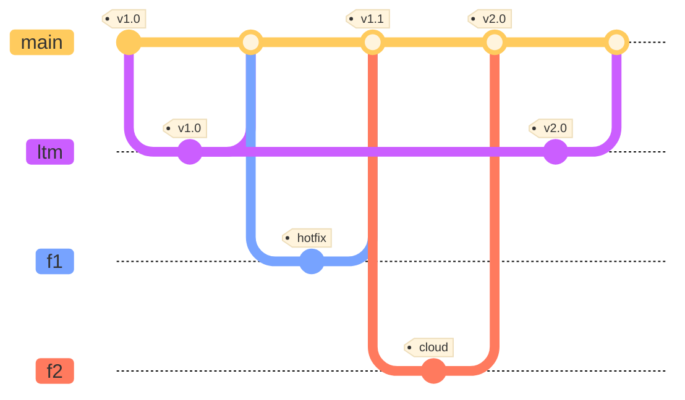

# Living Threat Model (LTM)

## GitFlow (Reactive)

```mermaid
%%{init: { 'logLevel': 'debug', 'theme': 'base', 'gitGraph': {'showBranches': true, 'showCommitLabel':false}} }%%
    gitGraph
        commit tag: "v1.0"
        branch ltm
        checkout ltm
        commit tag: "v1.0"
        checkout main
        merge ltm
        branch f1
        checkout f1
        commit tag: "hotfix"
        checkout main
        merge f1 tag: "v1.1"
        branch f2
        checkout f2
        commit tag: "cloud"
        checkout main
        merge f2 tag: "v2.0"
        checkout ltm
        commit tag: "v2.0"
        checkout main
        merge ltm
```