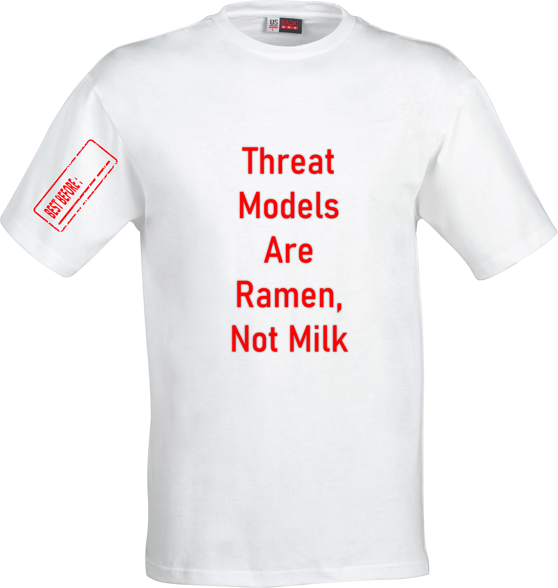
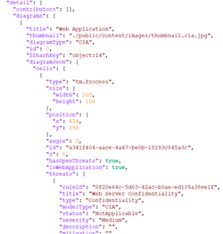
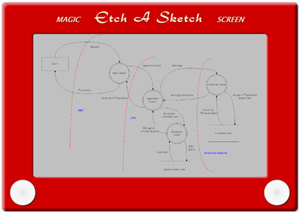
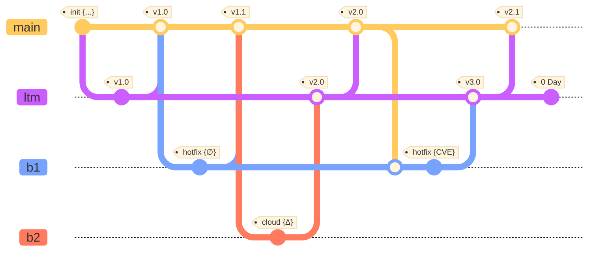
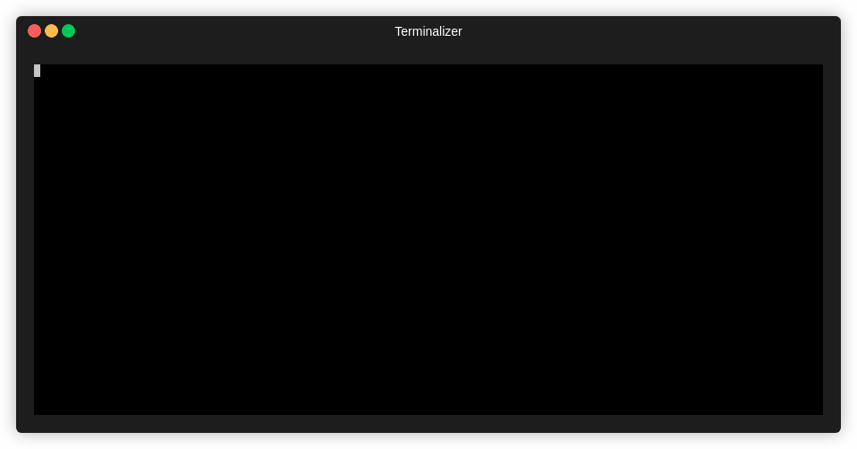

# Living Threat Model (LTM)

### When Apps Evolve, So Does the Risk And So Should the Threat Model



### All Threat Models Should Be Machine Readable



### Threat Model Tools Are Dangerously Shiny Objects



### Put the TM in the CI/CD



### THREATS.md Is the New README.md

````
```threats
---
 name: "A Threat Model"
 date: 2022-06-11
assets:
   - database
   - ...
trust_boundaries:
   - public: https
   - ...
```
````

### Scan Threat Models Like You Scan Code



### Must Feed the TM to Keep It Alive


