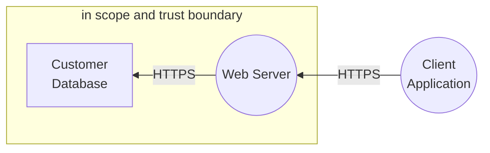

# Mermaid Threat Model

```mermaid
flowchart RL
    client((Client\nApplication)) --HTTPS--> webserver((Web Server))
    subgraph in scope and trust boundary
        webserver((Web Server)) --HTTPS--> databasep[Customer\n Database]
    end
```